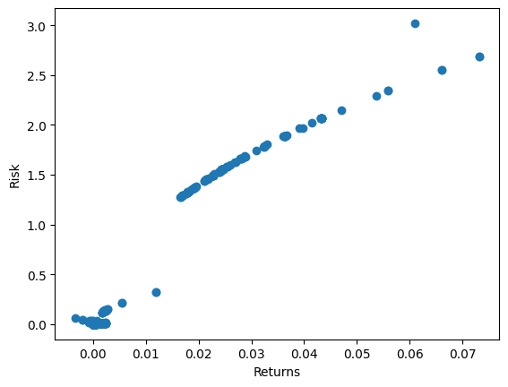
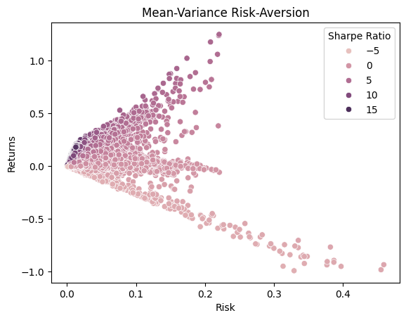

# Mutual-Funds-Analysis
Mutual Funds Analysis


📊 Excited to share insights from my recent project on Mutual Fund Analysis! Here’s a glimpse into the journey:

1️⃣ Leveraged the MFA API to gather comprehensive data from over 13,000 mutual funds.

2️⃣ Applied rigorous data cleaning techniques to ensure accuracy and reliability.

3️⃣ Calculated risk and returns based on the past 6 months' data, essential for informed decision-making.

4️⃣ Conducted correlation analysis across the funds to understand their interrelationships.

5️⃣ Grouped funds based on their negative, neutral, and positive correlations, identifying strategic clusters.

6️⃣ Implemented Monte Carlo simulation, generating 100,000 portfolios with 9 funds each, incorporating diverse correlation scenarios.

7️⃣ Utilized PowerBI to create dynamic dashboards, visualizing portfolio compositions and performance metrics.

8️⃣ Plotted efficient frontier plots to visualize risk-return trade-offs, essential for optimizing portfolio strategies.

9️⃣ Achieved a best Sharpe ratio of 21, highlighting the effectiveness of our approach in maximizing returns relative to risk.


[embed][http://example.com/file.pdf](https://github.com/akshayparate123/Mutual-Funds-Analysis/blob/main/MutualFundsDashboard.pdf)[/embed]


```python
import pandas as pd
from sqlalchemy import create_engine
import numpy as np
import warnings
warnings.filterwarnings("ignore")
import sys
import matplotlib.pyplot as plt
from datetime import datetime, timedelta

```


```python
user = 'xxxxxxxxx'
passw = 'xxxxxxxxx'
host =  'xxx.xx.xxx.xxx'
port = 3306
database = 'mutual_funds'
# Create an engine instance
engine = create_engine(f'mysql+pymysql://{user}:{passw}@{host}:{port}/{database}')
```

### Read data from database


```python
mutual_information_df = pd.read_sql('SELECT * FROM {}'.format("mutual_information"), con=engine)
```


```python
mutual_nav = pd.read_sql('SELECT * FROM {}'.format("mutual_nav"), con=engine)
```


```python
mutual_nav.head()
```


<div>
<style scoped>
    .dataframe tbody tr th:only-of-type {
        vertical-align: middle;
    }

    .dataframe tbody tr th {
        vertical-align: top;
    }

    .dataframe thead th {
        text-align: right;
    }
</style>
<table border="1" class="dataframe">
  <thead>
    <tr style="text-align: right;">
      <th></th>
      <th>id</th>
      <th>date</th>
      <th>nav</th>
      <th>scheme_code</th>
    </tr>
  </thead>
  <tbody>
    <tr>
      <th>0</th>
      <td>1</td>
      <td>04-06-2024</td>
      <td>112.247</td>
      <td>106157</td>
    </tr>
    <tr>
      <th>1</th>
      <td>3</td>
      <td>31-05-2024</td>
      <td>112.374</td>
      <td>106157</td>
    </tr>
    <tr>
      <th>2</th>
      <td>4</td>
      <td>30-05-2024</td>
      <td>112.346</td>
      <td>106157</td>
    </tr>
    <tr>
      <th>3</th>
      <td>5</td>
      <td>29-05-2024</td>
      <td>112.312</td>
      <td>106157</td>
    </tr>
    <tr>
      <th>4</th>
      <td>6</td>
      <td>28-05-2024</td>
      <td>112.331</td>
      <td>106157</td>
    </tr>
  </tbody>
</table>
</div>


```python
mutual_information_df.head()
```


<div>
<style scoped>
    .dataframe tbody tr th:only-of-type {
        vertical-align: middle;
    }

    .dataframe tbody tr th {
        vertical-align: top;
    }

    .dataframe thead th {
        text-align: right;
    }
</style>
<table border="1" class="dataframe">
  <thead>
    <tr style="text-align: right;">
      <th></th>
      <th>scheme_code</th>
      <th>fund_house</th>
      <th>scheme_type</th>
      <th>scheme_category</th>
      <th>scheme_name</th>
    </tr>
  </thead>
  <tbody>
    <tr>
      <th>0</th>
      <td>100033</td>
      <td>Aditya Birla Sun Life Mutual Fund</td>
      <td>Open Ended Schemes</td>
      <td>Equity Scheme - Large &amp; Mid Cap Fund</td>
      <td>Aditya Birla Sun Life Equity Advantage Fund - ...</td>
    </tr>
    <tr>
      <th>1</th>
      <td>100034</td>
      <td>Aditya Birla Sun Life Mutual Fund</td>
      <td>Open Ended Schemes</td>
      <td>Equity Scheme - Large &amp; Mid Cap Fund</td>
      <td>Aditya Birla Sun Life Equity Advantage Fund -R...</td>
    </tr>
    <tr>
      <th>2</th>
      <td>100037</td>
      <td>Aditya Birla Sun Life Mutual Fund</td>
      <td>Open Ended Schemes</td>
      <td>Debt Scheme - Medium to Long Duration Fund</td>
      <td>Aditya Birla Sun Life Income Fund - Regular - ...</td>
    </tr>
    <tr>
      <th>3</th>
      <td>100038</td>
      <td>Aditya Birla Sun Life Mutual Fund</td>
      <td>Open Ended Schemes</td>
      <td>Debt Scheme - Medium to Long Duration Fund</td>
      <td>Aditya Birla Sun Life Income Fund - Growth - R...</td>
    </tr>
    <tr>
      <th>4</th>
      <td>100041</td>
      <td>Aditya Birla Sun Life Mutual Fund</td>
      <td>360 ONE Mutual Fund</td>
      <td>Formerly Known as IIFL Mutual Fund</td>
      <td>Aditya Birla Sun Life Liquid Fund -Institution...</td>
    </tr>
  </tbody>
</table>
</div>


```python
scheme_codes = mutual_information_df["scheme_code"]
```


```python
scheme_codes
```


    0        100033
    1        100034
    2        100037
    3        100038
    4        100041
              ...  
    13060    152646
    13061    152647
    13062    152648
    13063    152653
    13064    152654
    Name: scheme_code, Length: 13065, dtype: int64


### Calculating mean and std deviation along with generating new dataframe with same dates for correlation calculation


```python
def calculate_mean_std(scheme_code,six_months_ago):
    filtered_df = mutual_nav[mutual_nav["scheme_code"] == scheme_code]
    filtered_df["date"] = pd.to_datetime(filtered_df['date'], format='%d-%m-%Y')
    df_sorted = filtered_df.sort_values(by='date')
    df_sorted["returns"] = df_sorted["nav"].pct_change()
    mean = np.mean(df_sorted["returns"])
    std = np.std(df_sorted["returns"])
    df = df_sorted[df_sorted["date"] >= six_months_ago]
    df = df.rename(columns={'nav': scheme_code})
    return mean,std,df[["date",scheme_code]]
```


```python
meanList = [];stdList = []
six_months_ago = datetime.now() - timedelta(days=6*30)
nav_df = pd.DataFrame(columns = ["date","nav"])
for idx,code in enumerate(scheme_codes):
    if idx % 1000 == 0:
        print(f'\rProgress: {idx}/{len(scheme_codes)}', end='', flush=True)
    mean,std,df = calculate_mean_std(code,six_months_ago)
    if len(df) >= 100:
        nav_df = pd.merge(nav_df, df, on='date', how='outer')
    meanList.append(mean); stdList.append(std)
nav_df.drop(["nav"],axis =1,inplace = True)
nav_df.dropna(inplace=True)
nav_df.index = nav_df["date"]
nav_df.drop("date",axis = 1,inplace=True)
```

    Progress: 13000/13065


```python
nav_df.head()
```


<div>
<style scoped>
    .dataframe tbody tr th:only-of-type {
        vertical-align: middle;
    }

    .dataframe tbody tr th {
        vertical-align: top;
    }

    .dataframe thead th {
        text-align: right;
    }
</style>
<table border="1" class="dataframe">
  <thead>
    <tr style="text-align: right;">
      <th></th>
      <th>100033</th>
      <th>100034</th>
      <th>100037</th>
      <th>100038</th>
      <th>100041</th>
      <th>100042</th>
      <th>100043</th>
      <th>100044</th>
      <th>100046</th>
      <th>100047</th>
      <th>...</th>
      <th>152265</th>
      <th>152266</th>
      <th>152267</th>
      <th>152268</th>
      <th>152269</th>
      <th>152270</th>
      <th>152271</th>
      <th>152272</th>
      <th>152278</th>
      <th>152279</th>
    </tr>
    <tr>
      <th>date</th>
      <th></th>
      <th></th>
      <th></th>
      <th></th>
      <th></th>
      <th></th>
      <th></th>
      <th></th>
      <th></th>
      <th></th>
      <th></th>
      <th></th>
      <th></th>
      <th></th>
      <th></th>
      <th></th>
      <th></th>
      <th></th>
      <th></th>
      <th></th>
      <th></th>
    </tr>
  </thead>
  <tbody>
    <tr>
      <th>2024-01-04</th>
      <td>768.24</td>
      <td>127.88</td>
      <td>13.0195</td>
      <td>111.068</td>
      <td>108.023</td>
      <td>615.115</td>
      <td>631.235</td>
      <td>163.694</td>
      <td>100.195</td>
      <td>379.048</td>
      <td>...</td>
      <td>10.3475</td>
      <td>10.3475</td>
      <td>10.0071</td>
      <td>10.0062</td>
      <td>10.0062</td>
      <td>10.0068</td>
      <td>10.0256</td>
      <td>10.0256</td>
      <td>10.0260</td>
      <td>10.0260</td>
    </tr>
    <tr>
      <th>2024-01-09</th>
      <td>765.68</td>
      <td>127.45</td>
      <td>13.0557</td>
      <td>111.376</td>
      <td>108.023</td>
      <td>615.740</td>
      <td>631.876</td>
      <td>163.694</td>
      <td>100.195</td>
      <td>379.433</td>
      <td>...</td>
      <td>10.3929</td>
      <td>10.3929</td>
      <td>10.0321</td>
      <td>10.0308</td>
      <td>10.0308</td>
      <td>10.0318</td>
      <td>10.0345</td>
      <td>10.0345</td>
      <td>10.0351</td>
      <td>10.0351</td>
    </tr>
    <tr>
      <th>2024-01-10</th>
      <td>767.33</td>
      <td>127.72</td>
      <td>13.0673</td>
      <td>111.475</td>
      <td>108.023</td>
      <td>615.868</td>
      <td>632.008</td>
      <td>163.694</td>
      <td>100.195</td>
      <td>379.512</td>
      <td>...</td>
      <td>10.4122</td>
      <td>10.4122</td>
      <td>10.0398</td>
      <td>10.0385</td>
      <td>10.0385</td>
      <td>10.0396</td>
      <td>10.0360</td>
      <td>10.0360</td>
      <td>10.0367</td>
      <td>10.0367</td>
    </tr>
    <tr>
      <th>2024-01-11</th>
      <td>769.04</td>
      <td>128.01</td>
      <td>13.0796</td>
      <td>111.580</td>
      <td>108.023</td>
      <td>615.982</td>
      <td>632.125</td>
      <td>163.694</td>
      <td>100.195</td>
      <td>379.582</td>
      <td>...</td>
      <td>10.4982</td>
      <td>10.4982</td>
      <td>10.0531</td>
      <td>10.0517</td>
      <td>10.0517</td>
      <td>10.0528</td>
      <td>10.0372</td>
      <td>10.0372</td>
      <td>10.0379</td>
      <td>10.0379</td>
    </tr>
    <tr>
      <th>2024-01-16</th>
      <td>775.25</td>
      <td>129.04</td>
      <td>13.1062</td>
      <td>111.807</td>
      <td>108.023</td>
      <td>616.560</td>
      <td>632.718</td>
      <td>163.694</td>
      <td>100.195</td>
      <td>379.938</td>
      <td>...</td>
      <td>10.5325</td>
      <td>10.5325</td>
      <td>10.0730</td>
      <td>10.0712</td>
      <td>10.0713</td>
      <td>10.0728</td>
      <td>10.0463</td>
      <td>10.0463</td>
      <td>10.0472</td>
      <td>10.0472</td>
    </tr>
  </tbody>
</table>
<p>5 rows × 7109 columns</p>
</div>


```python
mutual_information_df["mean_returns"] = meanList
mutual_information_df["risk"] = stdList
```


```python
mutual_information_df[mutual_information_df["risk"] >= 30]
```


<div>
<style scoped>
    .dataframe tbody tr th:only-of-type {
        vertical-align: middle;
    }

    .dataframe tbody tr th {
        vertical-align: top;
    }

    .dataframe thead th {
        text-align: right;
    }
</style>
<table border="1" class="dataframe">
  <thead>
    <tr style="text-align: right;">
      <th></th>
      <th>scheme_code</th>
      <th>fund_house</th>
      <th>scheme_type</th>
      <th>scheme_category</th>
      <th>scheme_name</th>
      <th>mean_returns</th>
      <th>risk</th>
    </tr>
  </thead>
  <tbody>
  </tbody>
</table>
</div>


```python
mutual_information_df = mutual_information_df[mutual_information_df["mean_returns"] != np.inf]
mutual_information_df.reset_index(inplace=True)
```


```python
plt.scatter(mutual_information_df["mean_returns"],mutual_information_df["risk"])
plt.xlabel('Returns')
plt.ylabel('Risk')
```


    Text(0, 0.5, 'Risk')


    

    


### Filtering the mutual funds


```python
inx = []
for i in range(0,len(mutual_information_df)):
    if i%1000 == 0:
        print(f'\rProgress: {i}/{len(mutual_information_df)}', end='', flush=True)
    if mutual_information_df["scheme_code"][i] not in list(nav_df.columns):
        inx.append(i)
mutual_information_df = mutual_information_df.drop(index = inx)
```

    Progress: 12000/12745


```python
mutual_information_df.drop(["index"],axis = 1,inplace = True)
```


```python
mutual_information_df = mutual_information_df[mutual_information_df["risk"] != 0]
mutual_information_df = mutual_information_df[mutual_information_df["mean_returns"] != 0]
```

### Calculating correlation of mutual funds


```python
nav_df_corr = nav_df.corr()
```


```python
nav_df_corr.head()
```


<div>
<style scoped>
    .dataframe tbody tr th:only-of-type {
        vertical-align: middle;
    }

    .dataframe tbody tr th {
        vertical-align: top;
    }

    .dataframe thead th {
        text-align: right;
    }
</style>
<table border="1" class="dataframe">
  <thead>
    <tr style="text-align: right;">
      <th></th>
      <th>100033</th>
      <th>100034</th>
      <th>100037</th>
      <th>100038</th>
      <th>100041</th>
      <th>100042</th>
      <th>100043</th>
      <th>100044</th>
      <th>100046</th>
      <th>100047</th>
      <th>...</th>
      <th>152265</th>
      <th>152266</th>
      <th>152267</th>
      <th>152268</th>
      <th>152269</th>
      <th>152270</th>
      <th>152271</th>
      <th>152272</th>
      <th>152278</th>
      <th>152279</th>
    </tr>
  </thead>
  <tbody>
    <tr>
      <th>100033</th>
      <td>1.000000</td>
      <td>1.000000</td>
      <td>0.194246</td>
      <td>0.670588</td>
      <td>NaN</td>
      <td>0.768769</td>
      <td>0.768773</td>
      <td>NaN</td>
      <td>NaN</td>
      <td>0.768759</td>
      <td>...</td>
      <td>0.897732</td>
      <td>0.897720</td>
      <td>0.689281</td>
      <td>0.685770</td>
      <td>0.685821</td>
      <td>0.689303</td>
      <td>0.763125</td>
      <td>0.763125</td>
      <td>0.762016</td>
      <td>0.763075</td>
    </tr>
    <tr>
      <th>100034</th>
      <td>1.000000</td>
      <td>1.000000</td>
      <td>0.194129</td>
      <td>0.670462</td>
      <td>NaN</td>
      <td>0.768697</td>
      <td>0.768701</td>
      <td>NaN</td>
      <td>NaN</td>
      <td>0.768688</td>
      <td>...</td>
      <td>0.897799</td>
      <td>0.897787</td>
      <td>0.689163</td>
      <td>0.685650</td>
      <td>0.685701</td>
      <td>0.689184</td>
      <td>0.763058</td>
      <td>0.763058</td>
      <td>0.761949</td>
      <td>0.763007</td>
    </tr>
    <tr>
      <th>100037</th>
      <td>0.194246</td>
      <td>0.194129</td>
      <td>1.000000</td>
      <td>0.516895</td>
      <td>NaN</td>
      <td>0.235884</td>
      <td>0.235888</td>
      <td>NaN</td>
      <td>NaN</td>
      <td>0.235897</td>
      <td>...</td>
      <td>0.092426</td>
      <td>0.092256</td>
      <td>0.484864</td>
      <td>0.491228</td>
      <td>0.491162</td>
      <td>0.484994</td>
      <td>0.233205</td>
      <td>0.233205</td>
      <td>0.234750</td>
      <td>0.233585</td>
    </tr>
    <tr>
      <th>100038</th>
      <td>0.670588</td>
      <td>0.670462</td>
      <td>0.516895</td>
      <td>1.000000</td>
      <td>NaN</td>
      <td>0.927483</td>
      <td>0.927481</td>
      <td>NaN</td>
      <td>NaN</td>
      <td>0.927484</td>
      <td>...</td>
      <td>0.467142</td>
      <td>0.466887</td>
      <td>0.998099</td>
      <td>0.998551</td>
      <td>0.998544</td>
      <td>0.998103</td>
      <td>0.928011</td>
      <td>0.928011</td>
      <td>0.928819</td>
      <td>0.928167</td>
    </tr>
    <tr>
      <th>100041</th>
      <td>NaN</td>
      <td>NaN</td>
      <td>NaN</td>
      <td>NaN</td>
      <td>NaN</td>
      <td>NaN</td>
      <td>NaN</td>
      <td>NaN</td>
      <td>NaN</td>
      <td>NaN</td>
      <td>...</td>
      <td>NaN</td>
      <td>NaN</td>
      <td>NaN</td>
      <td>NaN</td>
      <td>NaN</td>
      <td>NaN</td>
      <td>NaN</td>
      <td>NaN</td>
      <td>NaN</td>
      <td>NaN</td>
    </tr>
  </tbody>
</table>
<p>5 rows × 7109 columns</p>
</div>


### Finding negatively and neutraly correlated mutual funds


```python
columns = list(nav_df_corr.columns)
```


```python
strong_negative_correlation = {}
neutral_correlation = {}
index_val = nav_df_corr.index
for idx1,c in enumerate(columns):
    if idx1 % 1000 == 0:
        print(f'\rProgress: {idx1}/{len(columns)}', end='', flush=True)
    neg = list(nav_df_corr[nav_df_corr[c] < -0.9].index)
    neu = list(nav_df_corr[(nav_df_corr[c] > -0.3) & (nav_df_corr[c] < 0.3)].index)
    if len(neg) != 0:
        strong_negative_correlation[c] = neg
    if len(neu) != 0:
            neutral_correlation[c] = neu
    
```

    Progress: 7000/7109


```python
mutual_information_df.head()
```


<div>
<style scoped>
    .dataframe tbody tr th:only-of-type {
        vertical-align: middle;
    }

    .dataframe tbody tr th {
        vertical-align: top;
    }

    .dataframe thead th {
        text-align: right;
    }
</style>
<table border="1" class="dataframe">
  <thead>
    <tr style="text-align: right;">
      <th></th>
      <th>scheme_code</th>
      <th>fund_house</th>
      <th>scheme_type</th>
      <th>scheme_category</th>
      <th>scheme_name</th>
      <th>mean_returns</th>
      <th>risk</th>
    </tr>
  </thead>
  <tbody>
    <tr>
      <th>0</th>
      <td>100033</td>
      <td>Aditya Birla Sun Life Mutual Fund</td>
      <td>Open Ended Schemes</td>
      <td>Equity Scheme - Large &amp; Mid Cap Fund</td>
      <td>Aditya Birla Sun Life Equity Advantage Fund - ...</td>
      <td>0.000528</td>
      <td>0.013541</td>
    </tr>
    <tr>
      <th>1</th>
      <td>100034</td>
      <td>Aditya Birla Sun Life Mutual Fund</td>
      <td>Open Ended Schemes</td>
      <td>Equity Scheme - Large &amp; Mid Cap Fund</td>
      <td>Aditya Birla Sun Life Equity Advantage Fund -R...</td>
      <td>0.000217</td>
      <td>0.014590</td>
    </tr>
    <tr>
      <th>2</th>
      <td>100037</td>
      <td>Aditya Birla Sun Life Mutual Fund</td>
      <td>Open Ended Schemes</td>
      <td>Debt Scheme - Medium to Long Duration Fund</td>
      <td>Aditya Birla Sun Life Income Fund - Regular - ...</td>
      <td>0.000067</td>
      <td>0.003357</td>
    </tr>
    <tr>
      <th>3</th>
      <td>100038</td>
      <td>Aditya Birla Sun Life Mutual Fund</td>
      <td>Open Ended Schemes</td>
      <td>Debt Scheme - Medium to Long Duration Fund</td>
      <td>Aditya Birla Sun Life Income Fund - Growth - R...</td>
      <td>0.000318</td>
      <td>0.002578</td>
    </tr>
    <tr>
      <th>4</th>
      <td>100041</td>
      <td>Aditya Birla Sun Life Mutual Fund</td>
      <td>360 ONE Mutual Fund</td>
      <td>Formerly Known as IIFL Mutual Fund</td>
      <td>Aditya Birla Sun Life Liquid Fund -Institution...</td>
      <td>0.001584</td>
      <td>0.119376</td>
    </tr>
  </tbody>
</table>
</div>


```python
mutual_information_df = pd.merge(mutual_information_df, pd.DataFrame(list(strong_negative_correlation.items()), columns=['scheme_code', 'negatively_correlated_funds']), on='scheme_code', how='outer')
mutual_information_df = pd.merge(mutual_information_df, pd.DataFrame(list(neutral_correlation.items()), columns=['scheme_code', 'neutral_correlated_funds']), on='scheme_code', how='outer')
```


```python
mutual_information_df.dropna(inplace = True)
```


```python
mutual_information_df.head()
```


<div>
<style scoped>
    .dataframe tbody tr th:only-of-type {
        vertical-align: middle;
    }

    .dataframe tbody tr th {
        vertical-align: top;
    }

    .dataframe thead th {
        text-align: right;
    }
</style>
<table border="1" class="dataframe">
  <thead>
    <tr style="text-align: right;">
      <th></th>
      <th>scheme_code</th>
      <th>fund_house</th>
      <th>scheme_type</th>
      <th>scheme_category</th>
      <th>scheme_name</th>
      <th>mean_returns</th>
      <th>risk</th>
      <th>negatively_correlated_funds</th>
      <th>neutral_correlated_funds</th>
    </tr>
  </thead>
  <tbody>
    <tr>
      <th>5</th>
      <td>100042</td>
      <td>Aditya Birla Sun Life Mutual Fund</td>
      <td>360 ONE Mutual Fund</td>
      <td>Formerly Known as IIFL Mutual Fund</td>
      <td>Aditya Birla Sun Life Liquid Fund-Retail (Growth)</td>
      <td>0.001798</td>
      <td>0.119402</td>
      <td>[140617]</td>
      <td>[100037, 100048, 100051, 100123, 100233, 10028...</td>
    </tr>
    <tr>
      <th>6</th>
      <td>100043</td>
      <td>Aditya Birla Sun Life Mutual Fund</td>
      <td>360 ONE Mutual Fund</td>
      <td>Formerly Known as IIFL Mutual Fund</td>
      <td>Aditya Birla Sun Life Liquid Fund-Institutiona...</td>
      <td>0.001801</td>
      <td>0.119403</td>
      <td>[140617]</td>
      <td>[100037, 100048, 100051, 100123, 100233, 10028...</td>
    </tr>
    <tr>
      <th>9</th>
      <td>100047</td>
      <td>Aditya Birla Sun Life Mutual Fund</td>
      <td>360 ONE Mutual Fund</td>
      <td>Formerly Known as IIFL Mutual Fund</td>
      <td>Aditya Birla Sun Life Liquid Fund - Growth</td>
      <td>0.001805</td>
      <td>0.119405</td>
      <td>[140617]</td>
      <td>[100037, 100048, 100051, 100123, 100233, 10028...</td>
    </tr>
    <tr>
      <th>16</th>
      <td>100077</td>
      <td>DSP Mutual Fund</td>
      <td>Open Ended Schemes</td>
      <td>Debt Scheme - Medium Duration Fund</td>
      <td>DSP Bond Fund - IDCW</td>
      <td>0.000014</td>
      <td>0.003886</td>
      <td>[105888, 109108, 119500, 122643, 122645, 13953...</td>
      <td>[100037, 100048, 100051, 100057, 100079, 10008...</td>
    </tr>
    <tr>
      <th>17</th>
      <td>100078</td>
      <td>DSP Mutual Fund</td>
      <td>Open Ended Schemes</td>
      <td>Debt Scheme - Medium Duration Fund</td>
      <td>DSP Bond Fund - Growth</td>
      <td>0.000261</td>
      <td>0.001837</td>
      <td>[140617]</td>
      <td>[100048, 100051, 100082, 100085, 100233, 10028...</td>
    </tr>
  </tbody>
</table>
</div>


```python
unique_fund_house = list(mutual_information_df["fund_house"].unique())
```


```python
return_risk_df = pd.DataFrame()
return_risk_df["scheme_codes"] = scheme_codes
return_risk_df["return"] = meanList
return_risk_df["risk"] = stdList
```

### Generate Random Portfolios


```python
import random
def get_unique_funds(numOfFunds,unique_fund_house,mutual_information_df):
    fundsHouseList = []
    unique_random_integers = random.sample(range(0, len(unique_fund_house)), numOfFunds)
    fundDetailsList = []
    totFundsNum = 0
    for idx in unique_random_integers:
        fundDetails = []
        fundHouseName = unique_fund_house[idx]
        fundsHouseList.append(fundHouseName)
        fund_house_df = mutual_information_df[mutual_information_df["fund_house"]==fundHouseName]
        random_fund_number = random.sample(range(0, len(fund_house_df)), 1)
        fund = fund_house_df.iloc[random_fund_number[0]]
        fundDetails.append(fund["scheme_code"])
        negatively_correlated_funds = list(fund["negatively_correlated_funds"])
        neutral_correlated_funds = list(fund["neutral_correlated_funds"])
        tempGen = random.sample(range(0, len(negatively_correlated_funds)), 1)
        fundDetails.append(negatively_correlated_funds[tempGen[0]])
        tempGen = random.sample(range(0, len(neutral_correlated_funds)), 1)
        fundDetails.append(neutral_correlated_funds[tempGen[0]])
        fundDetailsList.append(fundDetails)
        totFundsNum = totFundsNum+1
    return fundDetailsList,totFundsNum
```


```python

```


```python
def calculate_risk_return_of_unique_funds(unique_funds_list,numOfFunds,totFundsNum):
    fund_name = []
    riskList = []
    returnsList = []
    portfolioDict = {"fundsName":[],"weights":[],"portfolioRet":[],"portfolioVol":[],"sharpe_ratio":[]}
    for i in unique_funds_list:
        for j in i:
            fund_name.append(j)
    filtered_df = nav_df[fund_name]
    fund_name = list(filtered_df.columns)
    for idx,col in enumerate(list(filtered_df.columns)):
        if any(value < -0.05 for value in list(filtered_df[col].pct_change())):
            filtered_df.drop(col,inplace = True,axis =1)
    randomWeight = np.random.dirichlet(np.ones(len(filtered_df.columns)), size=1)[0]
    for idx,col in enumerate(list(filtered_df.columns)):
        filtered_df[col] = filtered_df[col] * randomWeight[idx]
    filtered_df["total_profit"] = filtered_df.sum(axis=1)
    filtered_df["pct_change"] = np.log1p(filtered_df["total_profit"].pct_change().dropna())
    portfolioDict["portfolioRet"].append(np.mean(filtered_df["pct_change"]) * 252)
    portfolioDict["portfolioVol"].append(np.std(filtered_df["pct_change"]) * np.sqrt(252))
    if len(randomWeight) != len(fund_name):
        # print(randomWeight)
        # print([np.nan]*(len(fund_name) - len(randomWeight)))
        randomWeight = list(randomWeight) + ([np.nan]*(len(fund_name) - len(randomWeight)))
    for idx in range(0,len(fund_name)):
        portfolioDict["fund_{}".format(idx)] = fund_name[idx]
        portfolioDict["weight_{}".format(idx)] = randomWeight[idx]
    #Assuming risk free rate as 0
    portfolioDict["fundsName"].append(fund_name)
    portfolioDict["weights"].append(randomWeight)
    portfolioDict["sharpe_ratio"].append(((np.mean(filtered_df["pct_change"]) * 252))/(np.std(filtered_df["pct_change"]) * np.sqrt(252)))
    portfolioDf = pd.DataFrame(portfolioDict)
    return portfolioDf
```


```python
numOfPortfolio = 100000
portfolioDf = pd.DataFrame()
# unique_funds_list = [[149265, 150802, 135792], [149033, 140617, 149521], [118551, 109446, 118408]]
# totFundsNum = 9
for i in range(0,numOfPortfolio):
    print(f'\rProgress: {i}/{numOfPortfolio}', end='', flush=True)
    unique_funds_list,totFundsNum = get_unique_funds(3,unique_fund_house,mutual_information_df)
    newRow = calculate_risk_return_of_unique_funds(unique_funds_list,3,totFundsNum)
    portfolioDf = pd.concat([portfolioDf, newRow], ignore_index=True)
# portfolioDf["sharpe_ratio"] = (portfolioDf["return"] - 0.07)/portfolioDf["risk"]
```

    Progress: 90568/100000


```python
new_portfolioDf = portfolioDf[portfolioDf["portfolioRet"] > -1]
```


```python
import seaborn as sns
sns.scatterplot(x='portfolioVol', y='portfolioRet', data=new_portfolioDf, hue='sharpe_ratio')
# plt.scatter(portfolioDf["risk"][6388], portfolioDf["return"][6388], color='red', marker='x', s=20, label='Best Sharpe')
plt.title('Mean-Variance Risk-Aversion')
plt.xlabel('Risk')
plt.ylabel('Returns')
plt.legend(title='Sharpe Ratio')
```


    <matplotlib.legend.Legend at 0x1bed217cac0>


    

    


